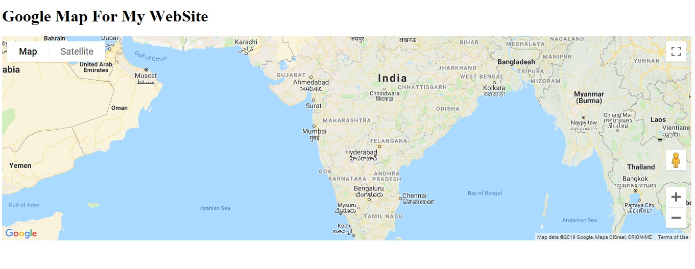
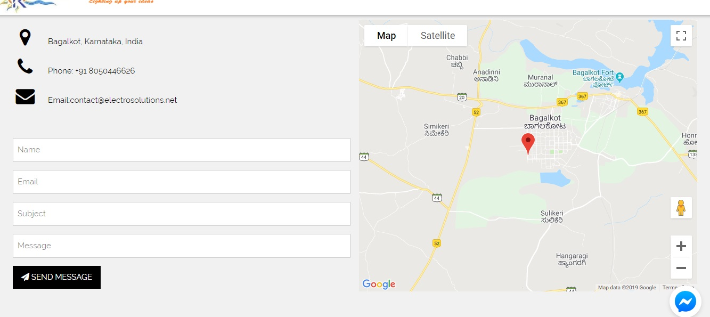

# Map-for-Website
Adding location in Map for your  in website, markes your website rich and helps user to reach you out in your place.

Example given explains in detail step by step assuming that reader is begginer to the web-development.Below Img's shows how this app looks on your website(Size of map is configurable as per your requirment).
Img from code snippet given 

Example taken from one of my designed site.

A attachment for the complete code snippet is available above, you can download it and just paste the code in your program where you want to add a Map. For the Map's size, width and height are configurable so modify as per you requirement.

Before entering into the coding part First you need to get the Google API key(Unique Key).
# "Free Google API Key"
Google allows a website to call any Google API for free, thousands of times a day.

Go to --> https://developers.google.com/maps/documentation/javascript/get-api-key to learn how to get an API key. 
1.Click on getting started--> follow the instruction (Asks some basic requirement).
2.Create an Account 
3.Get registered
4.Create new project And Unique Id is generated for you.
5.Google Maps expects to find the API key in the key parameter when loading an API:Hence use that key in the below mentioned line in the code.
 ""

To get proper location co-ordinates, go to https://www.latlong.net/ (other sites are also available in google)Its just an example. point out your location in map and take out the co-ordinate values and use them in your code.

# Some basic info related to Map properties in code
The mapProp variable defines the properties for the map.

The center property specifies where to center the map (using latitude and longitude coordinates).

The zoom property specifies the zoom level for the map (try to experiment with the zoom level).

The line: var map=new google.maps.Map(document.getElementById("googleMap"), mapProp); creates a new map inside the 
 element with id="googleMap", using the parameters that are passed (mapProp).

Finally Run the code you will be able to see your Map in your website.

references considered for the article: 
W3school.com
Electrosolutions.net
